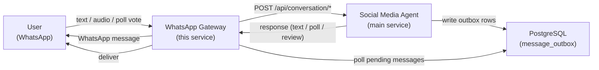

# WhatsApp Gateway


WhatsApp Web bridge for sending and receiving messages on behalf of an external service.

---

**[Features](#features)** · **[Tech Stack](#tech-stack)** · **[Architecture](#architecture)** · **[Message Outbox](#message-outbox)** · **[QR Authentication](#qr-authentication)** · **[Getting Started](#getting-started)** · **[Configuration](#configuration)** · **[Running with Docker](#running-with-docker)** · **[CI/CD](#cicd)**

---

This service acts as the WhatsApp communication layer for the [Social Media Agent](https://github.com/em-hache/social-media-agent). It connects to WhatsApp Web using Puppeteer, listens for incoming messages (text, audio, and poll votes), forwards them to the main service's API, and relays the response back to the user as a WhatsApp message. In the outgoing direction, it polls a PostgreSQL message outbox for approved messages and delivers them to recipients via WhatsApp.

The two services are fully decoupled: this gateway knows nothing about conversation state, message crafting, or business logic -- it is purely a transport adapter. The main service writes delivery intents to the shared `message_outbox` table, and this gateway picks them up and sends them.

## Features

- **Bidirectional message relay** -- forwards incoming WhatsApp messages (text and audio) to the main service and sends replies back
- **Poll support** -- creates WhatsApp polls from API responses and forwards poll votes back to the main service as text messages
- **Message outbox consumer** -- polls a PostgreSQL outbox table for pending messages and delivers them via WhatsApp with retry logic
- **QR code authentication** -- exposes an HTTP endpoint serving the WhatsApp Web QR code as a PNG image for remote scanning
- **Blacklisting** -- silently ignores messages from configured phone numbers
- **Graceful shutdown** -- handles SIGINT/SIGTERM to close the database pool and stop the QR server cleanly

## Tech Stack

| Component | Technology |
|-----------|------------|
| Language | TypeScript 5.9 |
| Runtime | Node.js 22 |
| WhatsApp automation | whatsapp-web.js (Puppeteer + Chromium) |
| Database | PostgreSQL (via `pg` connection pool) |
| QR code generation | qrcode + qrcode-terminal |
| Containerization | Docker (multi-stage build) |

## Architecture

### End-to-end flow



### Incoming message flow

1. WhatsApp Web fires a `message` or `vote_update` event
2. The gateway filters out blacklisted senders and messages that arrived before the client was ready
3. Text messages are forwarded as JSON to `POST /api/conversation/textmessage`
4. Audio messages are downloaded, converted to a `FormData` payload, and sent to `POST /api/conversation/audiomessage`
5. Poll votes are forwarded as text messages containing the selected option name
6. The main service responds with one of three reply types (`text`, `poll`, or `review`), and the gateway translates it into the appropriate WhatsApp message format

### Outgoing message flow (outbox)

1. The main service writes one row per recipient into the `message_outbox` table when a message is approved
2. This gateway polls the table on a configurable interval
3. Each poll cycle claims a batch of pending messages using `SELECT ... FOR UPDATE SKIP LOCKED`
4. Messages are sent sequentially with a configurable delay between each send
5. Successful sends are marked `sent`; failures are retried up to a maximum number of attempts

### Project structure

```
src/
├── config/
│   ├── env.ts              # Environment variable loading
│   └── blacklist.ts        # Blacklisted phone numbers
├── db/
│   ├── connection_pool.ts  # PostgreSQL connection pool
│   └── message_queries.ts  # Outbox SQL queries (claim, mark sent/failed, reset)
├── incoming/
│   ├── conversation_message.ts  # Text & audio message processing
│   └── conversation_poll.ts     # Poll vote event processing
├── outgoing/
│   ├── message_processor.ts     # Outbox polling loop
│   └── conversation_response.ts # API response → WhatsApp message translation
├── qr/
│   ├── server.ts           # HTTP server for QR code endpoint
│   └── storage.ts          # QR code image lifecycle
└── index.ts                # Entry point: client setup, event wiring, shutdown
```

## Message Outbox

The gateway acts as the consumer side of the **transactional outbox pattern** implemented by the main service. The main service writes delivery intents to a shared PostgreSQL `message_outbox` table; this gateway reads and delivers them.

### How it works

1. **Claim a batch.** Every poll cycle, the processor runs a CTE query that selects up to `OUTBOX_BATCH_SIZE` pending rows, skipping recipients who received a message within the `OUTBOX_MIN_SEND_INTERVAL_MS` window and rows that were recently attempted (backoff). Selected rows are atomically moved to `processing` status using `FOR UPDATE SKIP LOCKED`.

2. **Send sequentially.** Each claimed message is sent via `client.sendMessage()` with a configurable delay between sends to avoid triggering WhatsApp rate limits.

3. **Mark outcome.** Successful sends are marked `sent` with a `completed_at` timestamp. Failures increment `attempt_count` and record the error message. If `attempt_count` reaches `OUTBOX_MAX_RETRIES`, the message is marked `failed`; otherwise it returns to `pending` for retry after the backoff period.

4. **Stale recovery.** On startup, any rows stuck in `processing` (from a previous crash) are reset to `pending` so they can be retried.

### Outbox entry lifecycle

```
PENDING  ──>  PROCESSING  ──>  SENT
                  │
                  └──>  PENDING (retry)  ──>  FAILED (max retries reached)
```

### Anti-spam protections

- **Per-recipient rate limiting** -- a recipient who was successfully sent a message within the last `OUTBOX_MIN_SEND_INTERVAL_MS` (default 1 hour) is skipped until the window expires
- **Deduplication** -- `DISTINCT ON (recipient_phone)` ensures only one message per recipient is claimed per batch, preventing message floods
- **Backoff** -- failed messages are not retried until `OUTBOX_BACKOFF_MS` has elapsed since the last attempt

## QR Authentication

WhatsApp Web requires scanning a QR code from an authenticated device to establish a session. This gateway provides two ways to access the QR code:

1. **Terminal** -- the QR code is printed directly to the console on startup using `qrcode-terminal`
2. **HTTP endpoint** -- a lightweight HTTP server on port 3000 serves the QR code as a PNG image at `GET /qr`, useful for remote/containerized deployments where terminal access is impractical

Once authenticated, the session is persisted to disk (`.wwebjs_auth/` directory) using whatsapp-web.js's `LocalAuth` strategy. Subsequent restarts reuse the stored session without requiring a new QR scan. The `GET /qr` endpoint returns `204 No Content` when the client is already authenticated.

## Getting Started

### Prerequisites

- Node.js 22+
- PostgreSQL (optional -- only required for outbox message delivery)
- Chromium (installed automatically by Puppeteer in development; bundled in the Docker image)

### Installation

```bash
git clone https://github.com/em-hache/whatsapp-gw.git
cd whatsapp-gw

npm ci
```

### Environment setup

```bash
cp resources/.env.dev .env
# Edit .env and set at least MAIN_SERVICE_URL
# Set DB_* variables if you want outbox delivery
```

### Build and run

```bash
npm run build
npm start
```

The QR server will be available at `http://localhost:3000/qr`. Scan the QR code from WhatsApp on your phone to authenticate.

## Configuration

All configuration is managed through environment variables (or a `.env` file loaded via Node's `--env-file` flag).

### Application

| Variable | Description | Default |
|----------|-------------|:---:|
| `MAIN_SERVICE_URL` | URL of the main service to forward incoming messages to | `http://localhost:8000` |

### Database (optional)

If any of `DB_NAME`, `DB_USER`, or `DB_PASSWORD` is missing, the outbox processor is skipped entirely and the gateway operates in relay-only mode.

| Variable | Description | Default |
|----------|-------------|:---:|
| `DB_HOST` | PostgreSQL hostname | `localhost` |
| `DB_PORT` | PostgreSQL port | `5432` |
| `DB_NAME` | Database name | -- |
| `DB_USER` | Database user | -- |
| `DB_PASSWORD` | Database password | -- |
| `DB_SSL` | Enable SSL for the database connection | `true` |

### Outbox processor

| Variable | Description | Default |
|----------|-------------|:---:|
| `OUTBOX_POLL_INTERVAL_MS` | How often to poll for pending messages | `5000` |
| `OUTBOX_BATCH_SIZE` | Maximum messages to claim per poll cycle | `10` |
| `OUTBOX_SEND_DELAY_MS` | Delay between sending each message in a batch | `5000` |
| `OUTBOX_MAX_RETRIES` | Maximum send attempts before marking as failed | `3` |
| `OUTBOX_MIN_SEND_INTERVAL_MS` | Minimum time between sends to the same recipient | `3600000` |
| `OUTBOX_BACKOFF_MS` | Backoff period before retrying a failed message | `3600000` |

> **Secrets:** `DB_PASSWORD` authenticates against the PostgreSQL database. It must be provided outside the codebase via environment variables or a `.env` file. The `.env` file is gitignored and should never be committed.

## Running with Docker

The Docker image bundles Chromium and all required dependencies for whatsapp-web.js to run headlessly.

```bash
docker build -t whatsapp-gw .
docker run -p 3000:3000 --env-file .env -v whatsapp-auth:/app/.wwebjs_auth whatsapp-gw
```

The `-v whatsapp-auth:/app/.wwebjs_auth` volume mount persists the WhatsApp session across container restarts, avoiding the need to re-scan the QR code each time.

### Production deployment

In production, the gateway and main service typically run on the same Docker network. The `MAIN_SERVICE_URL` is set to the service's internal hostname:

```
MAIN_SERVICE_URL=http://social-media-agent:8000
```

## CI/CD

A GitHub Actions workflow at `.github/workflows/publish.yml` builds and publishes a Docker image to the GitHub Container Registry (`ghcr.io`) on every push to `main` and on version tags (`v*`). The image is tagged as `latest` for main-branch builds.